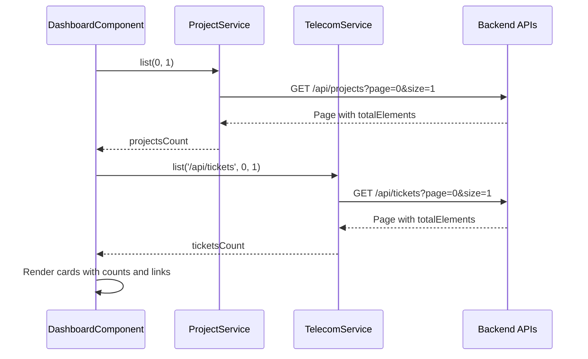

# Dashboard with cards (active tickets and projects)

## Using an image as inspiration

Yes. You can attach an image (e.g. a screenshot or mockup) and we’ll use it to guide:

- Card layout (grid, spacing, number of columns)
- Visual style (icons, labels, typography)
- Any extra elements (subtitles, “View all” placement)

If you don’t attach one, the implementation will use a simple, consistent card grid that matches the app’s existing `.card` style in [src/styles.scss](C:\git\angular\project-hub-app\src\styles.scss).

---

## Current state

- **Projects**: [ProjectService](C:\git\angular\project-hub-app\src\app\components\projects\service\project.service.ts) `list(page, size)` → returns paginated data with `totalElements`. Backend: `GET /api/projects?page=0&size=10`.
- **Tickets**: Handled as a telecom screen; [TelecomService](C:\git\angular\project-hub-app\src\app\components\telecom\service\telecom.service.ts) `list('/api/tickets', page, size)` returns the same shape. Backend: [TicketsController](c:\git\java\project-hub-service\src\main\java\pexper\projects\project_hub\controllers\TicketsController.java) extends `SimpleCrudController` → `GET /api/tickets?page=0&size=10` with `totalElements`.
- **Ticket entity** has no status/active field ([Ticket.java](c:\git\java\project-hub-service\src\main\java\pexper\projects\project_hub\domain\Ticket.java)); “active tickets” will be shown as **total ticket count**. A future “active” filter can be added if the backend gains a status field.
- **Routing**: Default `''` → `login`; post-login and auth guard currently send users to `/projects`. Sidebar has no Dashboard link ([sidebar.component.html](C:\git\angular\project-hub-app\src\app\shared\sidebar\sidebar.component.html)).

No new backend endpoints are required; the dashboard will use existing list APIs with `page=0` and `size=1` (or a small size) and use `totalElements` for counts.

---

## Implementation plan

### 1. Dashboard component and route

- **Create** `src/app/components/dashboard/` with:
  - `dashboard.component.ts`: Standalone component injecting `ProjectService` and `TelecomService`. On init, call:
    - `ProjectService.list(0, 1)` and store `totalElements` in a signal (e.g. `projectsCount`).
    - `TelecomService.list('/api/tickets', 0, 1)` and store `totalElements` in a signal (e.g. `ticketsCount`).
  - `dashboard.component.html`: A grid of **summary cards**:
    - **Active tickets**: display `ticketsCount`, short label, and a “View all” link to `/tickets`.
    - **Projects**: display `projectsCount`, short label, and a “View all” link to `/projects`.
  - `dashboard.component.scss`: Grid layout for cards (e.g. CSS Grid or flex), reusing global `.card` where appropriate so it matches [projects-list](C:\git\angular\project-hub-app\src\app\components\projects\list\projects-list.component.html) and [styles.scss](C:\git\angular\project-hub-app\src\styles.scss). If an inspiration image is provided, adjust layout/spacing to match.
- **Register route** in [app.routes.ts](C:\git\angular\project-hub-app\src\app\app.routes.ts):  
`{ path: 'dashboard', component: DashboardComponent, canActivate: [authGuard] }`  
and add the import for `DashboardComponent`.

### 2. Navigation and post-login redirect

- **Sidebar**: In [sidebar.component.html](C:\git\angular\project-hub-app\src\app\shared\sidebar\sidebar.component.html), add a “Dashboard” link as the **first** nav item: `routerLink="/dashboard"`, so it’s the top entry.
- **Login redirect**: In [login.component.ts](C:\git\angular\project-hub-app\src\app\components\login\login.component.ts), change both post-login `router.navigate` targets from `['/projects']` to `['/dashboard']`.
- **Auth guard**: In [auth.guard.ts](C:\git\angular\project-hub-app\src\app\auth\auth.guard.ts), change `createUrlTree(['/projects'])` to `createUrlTree(['/dashboard'])` so unauthenticated users trying to open a protected route are redirected to login, and after login they land on the dashboard.

### 3. Optional: “Recent” cards

- If desired (or if the inspiration image shows recent items), add a second row of cards:
  - **Recent tickets**: `TelecomService.list('/api/tickets', 0, 5)`; show first 5 (e.g. ticket number + project or client), link to `/tickets`.
  - **Recent projects**: `ProjectService.list(0, 5)`; show first 5 (e.g. project name), link to `/projects`.
- This can be done in the same component with two more signals and a small template block; no backend changes.

### 4. Optional: inspiration image

- If you provide an image, the plan will be updated to:
  - Match card size, grid columns, and gaps to the reference.
  - Add or align icons, labels, and “View all” placement.
  - Optionally add a dashboard title or subtitle to match the reference.

---

## Data flow (high level)

---

## Files to add

| Path                                                       | Purpose                                            |
| ---------------------------------------------------------- | -------------------------------------------------- |
| `src/app/components/dashboard/dashboard.component.ts`      | Component logic, signals, service calls            |
| `src/app/components/dashboard/dashboard.component.html`    | Card grid markup                                   |
| `src/app/components/dashboard/dashboard.component.scss`    | Grid and card layout                               |
| `src/app/components/dashboard/dashboard.component.spec.ts` | Unit tests (optional, can mirror other list specs) |

## Files to change

| Path                                                                                                   | Change                                                         |
| ------------------------------------------------------------------------------------------------------ | -------------------------------------------------------------- |
| [app.routes.ts](C:\git\angular\project-hub-app\src\app\app.routes.ts)                                  | Add `dashboard` route and `DashboardComponent` import          |
| [sidebar.component.html](C:\git\angular\project-hub-app\src\app\shared\sidebar\sidebar.component.html) | Add “Dashboard” as first nav link                              |
| [login.component.ts](C:\git\angular\project-hub-app\src\app\components\login\login.component.ts)       | Navigate to `'/dashboard'` instead of `'/projects'`            |
| [auth.guard.ts](C:\git\angular\project-hub-app\src\app\auth\auth.guard.ts)                             | Use `'/dashboard'` in `createUrlTree` instead of `'/projects'` |

---

## Summary

- **Cards**: Two main cards—Active tickets (total count) and Projects (total count)—with “View all” links.
- **Data**: Existing `ProjectService.list()` and `TelecomService.list('/api/tickets', ...)` with `totalElements`; no backend changes.
- **Landing**: Dashboard is the post-login page and first sidebar item; auth guard redirects to `/dashboard` when appropriate.
- **Image**: You can attach an inspiration image later; layout and style can then be adjusted to match it (and optional “Recent” cards added if the image suggests them).

